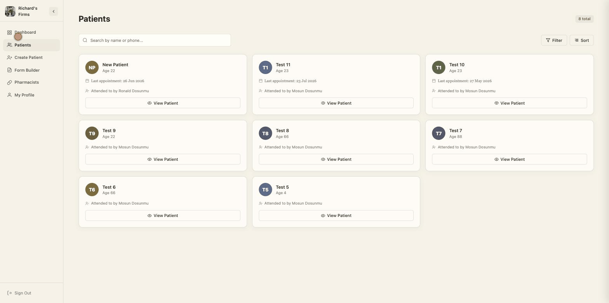

# Pharmact

A CRM built for independent pharmacies and pharmacy chains — manage patients, pharmacists, and multi-branch operations from one dashboard.


## Demo

🔗 **Live app:** [pharmact.vercel.app](https://pharmact.vercel.app)



## Tech Stack

React 19 · TypeScript · Vite · TanStack Query · React Router · Axios

## Features

**Authentication**
- Register, log in, verify email, and reset a forgotten password — each with its own dedicated flow

**Dashboard**
- At-a-glance overview: recent patients, last appointment dates, and an onboarding checklist for new accounts

**Patient Management**
- List, search, and filter patients based on different metrics, including their branch
- Create and update patient records
- Custom **Patient Intake Form Builder** — pharmacies aren't locked into one fixed form. Build intake forms from starter templates or completely from scratch, giving each pharmacy the freedom to define exactly what information it collects from patients, with a live preview mode to see the form as patients will

**Pharmacist Management**
- Add, edit, and remove pharmacists, each assignable to a branch

**Multi-Branch Support**
- Pharmacists, profiles, and patient filters are all branch-aware, so a pharmacy chain can manage multiple locations from one account

**Profile**
- Manage your own account details

**Legal / Compliance**
- Privacy policy and a self-service delete-account flow

## What I Learned

- I didn't expect small animations to matter this much. Things like the toast fading in, the success checkmark drawing itself, or the scroll fade on long lists — none of it is complicated, just a bit of CSS, but it's the difference between the app feeling done and feeling like a rough draft. I also learned you can overdo it. I added a few animations that ended up just slowing things down instead of helping, and had to pull them back out. Took a few tries to find the right amount.

- I also learned how to use Pencil.dev — it's a design tool that lets you sketch out a screen and turn it straight into real code, instead of designing in something like Figma and then rebuilding it from scratch in React. I used it for the form builder, the branch support UI, and the patients filter. Now when I'm starting a new feature, I usually lay it out in Pencil first instead of jumping straight into code.

- Building out the create/update/delete flows taught me there are two ways to handle updating the UI after a request: wait for the server to respond before updating anything (pessimistic), or update the UI right away and undo it if the request fails (optimistic). I went pessimistic across the board here since this app deals with patient data and I'd rather it be accurate than fast. It wasn't that I didn't know optimistic updates existed — I just made a call on what fit this project.

## What Could Be Improved

- **Code-splitting** — every route is statically imported, so the whole app ships as one bundle. Lazy-loading routes with `React.lazy` + `Suspense` would cut the initial load.
- **Test coverage** — tests currently cover the API layer and a handful of pages/components (~24% of source files). Broader coverage on the patient and pharmacist flows would catch regressions earlier.

## Getting Started

### Prerequisites
- Node.js
- The [backend API](https://github.com/Richydos2305/pharma-crm-backend) running locally or accessible remotely

### Installation

```bash
git clone https://github.com/Richydos2305/pharma-crm-frontend.git
cd pharma-crm-frontend
npm install
```

### Environment Variables

Create a `.env` file in the project root:

```
VITE_API_URL=http://localhost:<your-backend-port>
```

### Run locally

```bash
npm run dev
```

## Available Scripts

| Script | Description |
|---|---|
| `npm run dev` | Start the Vite dev server |
| `npm run build` | Type-check and build for production |
| `npm run lint` | Run ESLint |
| `npm run test` | Run the test suite (Vitest) |
| `npm run test:coverage` | Run tests with coverage |
| `npm run format` | Format with Prettier |
| `npm run validate` | Format check + lint + build |

## Deployment

Deployed on [Vercel](https://vercel.com) as a single-page app.

## Related Repositories

- [pharma-crm-backend](https://github.com/Richydos2305/pharma-crm-backend) — the API this frontend talks to
